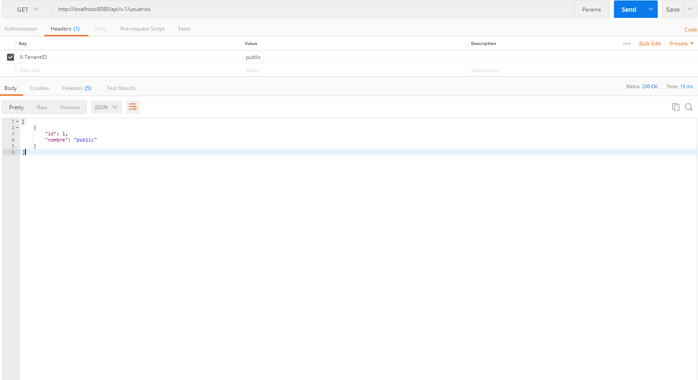

# multi-tenant-spring-boot

Ejemplo de implementación de multi-tentan (multi-tenancy) usando una misma base de datos pero diferentes esquemas para cada cliente.


## Construido con 🛠️

Este proyecto esta construido con las siguientes tecnologias:

* Java 1.8
* Spring MVC with Spring Boot
* Postgres
* Maven
* Flyway

 * La arquitectura web está construida con los siguientes componentes:
   * DTO: Objetos que se usan para la comunicación a través de las API
   * Controller: Responde a eventos lanzados por el usuario desde la web.
   * Service: Implementa la logica de procesamiento de información y la logica de negocio.
   * Repository: Interfaces para la base de datos, guarda, elimina y consulta.
   * Entity: Entidades de la base de datos.
   

### Instalación 🔧

* Clone el proyecto usando el comando

```
https://github.com/jhonfre1994/multi-tenant-spring-boot.git
```

* Abra el proyecto con NetBeans

* Modifique el archivo application.properties con la informacion de su base de datos.

```
spring.datasource.url=jdbc:postgresql://localhost:5432/tenant
spring.datasource.username=XXXX
spring.datasource.password=XXXX
```

* Compile el proyecto. Automanticamente se crearan las tablas y los esquemas.

* Use Postman u otro programa de su preferencia para ejecutar y probar el funcionamiento.

## Capturas de pantalla

* Ejemplo para el esquema public.



* Ejemplo para el esquema esquema1.


* Ejemplo para el esquema esquema2.


* En caso de no enviar el X-tenantID en el header de la  petición.


# Comando curl
Use comandos curl para probar las funciones del multi-tenant, el valor del header X-tenantID es el nombre
del esquema al cual se quiere consultar la información de los usuarios.

```
curl -i -H "X-tenantID: public" http://localhost:8080/api/v.1/usuarios/
curl -i -H "X-tenantID: esquema1" http://localhost:8080/api/v.1/usuarios/
curl -i -H "X-tenantID: esquema2" http://localhost:8080/api/v.1/usuarios/
```


## Autores ✒️

* **Jhon Freddy salamanca** - [jhonfre1994](https://github.com/jhonfre1994)

## Licencia 📄

Este proyecto está bajo la Licencia (MIT) - mira el archivo [LICENSE.md](https://github.com/jhonfre1994/multi-tenant-spring-boot/blob/main/LICENSE) para detalles
